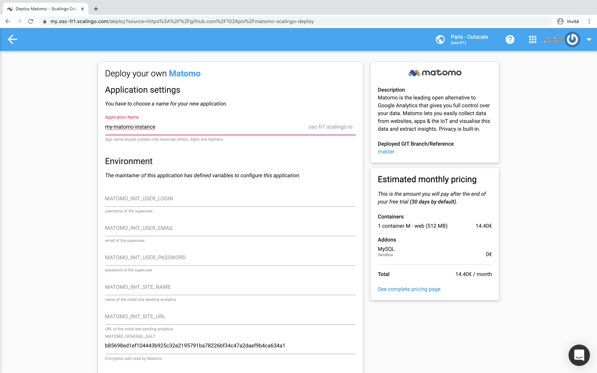

# Matomo-scalingo-deploy

[Matomo](https://matomo.org) is a free and open source web analytics application, designed to be an open and compliant with GDPR alternative to Google Analytics.

[Scalingo](https://scalingo.com) is a high-availability Platform as a Service (PaaS), like Heroku or Dokku.

This project is now based on [betagouv matomo-buildpack](https://github.com/betagouv/matomo-buildpack).

It was inspired by the PaaS buildpack [1024 pix matomo-buildpack](https://github.com/1024pix/matomo-buildpack).

## Usage

### Installation

As a pre-requesites, you must be connected to a valid (with a valid payment method) Scalingo account.

[](https://my.scalingo.com/deploy?source=https://github.com/betagouv/matomo-scalingo-deploy)

Then follow the steps below:

1. Fork this repository
2. From the GitHub interface of your fork, edit the `README.md` file and change the "Deploy to Scalingo" href link to your repository's one
3. Save, commit and push your change
4. Click on the "one-click deployment" button above ; you will be redirected to the Scalingo new application interface
5. Fill-up the form about the Matomo application environment variables and follow the instructions



### Configuration

#### Override Matomo version
You want to a different matomo version:
- set env variable `MATOMO_VERSION` to the new one
- Rebuild and deploy your app
- Then upgrade database: execute an one-off container with `bash bin/first-deploy-init.sh`

#### Override Matomo config

To update the matomo config, edit the config file `scripts/config.ini.php.tmpl`.
If you have secrets, set environnement variables and use them in the `scripts/config.ini.php.tmpl` file. For instance, we set the `MATOMO_SALT` this way.

#### Activating plugins

Set the environnement variable `MATOMO_PLUGINS` with a comma separated plugin list name. For instance you can enable the DbCommands, AdminCommands and LicenseKeyCommands plugins with `MATOMO_PLUGINS=DbCommands,AdminCommands,LicenseKeyCommands`.

#### Manage Purchased plugins

If not yet done, set the environment variable `MATOMO_LICENSE_KEY` with your own [Matomo license key](https://fr.matomo.org/faq/how-to/how-do-i-get-a-license-key-for-the-maxmind-geolocation-database/) in your Scalingo app.

Then, declare your purchased plugins by setting the `MATOMO_PURCHASED_PLUGINS` environment variable as below:

```shell script
MATOMO_PURCHASED_PLUGINS=Funnels:3.1.22,ActivityLog:3.4.0,RollUpReporting:3.2.7
```

> Unfortunately, the Matomo plugins API does not provide a way to fetch the latest version of a given plugin for a given version à of Matomo (3.X or 4.X). It is why we must precise the version of each plugin.

### Upgrade

> ⚠️ We strongly advise you to **not use the auto-update feature in the Matomo administration** interface at the risk of lose all your changes and having critical problems the next time your app will restart! 

There is multiple ways to upgrade your Matomo instance:
- a) change the env variable MATOMO_VERSION in your setting to the new one, rebuild/deploy and execute `bash bin/first-deploy-init.sh` in an on/off container
- b) wait for the [original repository](https://my.scalingo.com/deploy?source=https://github.com/betagouv/matomo-scalingo-deploy) to upgrade the current version and rebase your fork on it
- c) wait for [matomo buildpack](https://github.com/betagouv/matomo-buildpack) to release a new version and change yourself the buidpack in `./buildpacks` file

## Advanced usage

### Playing with the Matomo console

Matomo provides a [CLI console](https://developer.matomo.org/guides/piwik-on-the-command-line) within its distribution.

This program is written in PHP and requires such an environment to work.

You can easily access and run the Matomo console commands in a [Scalingo one-off container](https://doc.scalingo.com/platform/app/tasks). But in order to do it, you must previously regenerate the `/app/config/config.ini.php` file, in the same way as the `bin/start-matomo.sh` script.

```shell script
scalingo --app my-matomo-instance run bash # run a one-off container
./bin/generate-config-ini.sh # generate the /app/config/config.ini.php file
php console list # list all the Matomo console commands
```

### Exploring the database

First, run a one-off Scalingo container that loads the MySQL CLI:

```shell script
scalingo --app my-matomo-instance mysql-console # run a one-off container
```

Then, connect to your Matomo database and enjoy your MySQL commands.

```shell script
mysql> show databases; # list MySQL databases
mysql> use my_matomo_i_4515; # select the current database
mysql> show tables; # list all the DB tables
```

### Force SSL

According to the [Matomo documentation](https://fr.matomo.org/faq/how-to/faq_91/):

> Configuring Matomo (Piwik) so that all requests are made over SSL (https://) is an easy way to improve security and keep your data safer.

In the Scalingo app environment, add the environment variable:

```
MATOMO_GENERAL_FORCE_SSL=1
```

Save your configuration and restart your application. That's it!

### Disable Matomo Tracking

According to the [Matomo documentation](https://matomo.org/faq/how-to/faq_111/):

> Before a Database upgrade on a high traffic Matomo (Piwik) server, it is highly recommended to disable Matomo Tracking.

In the Scalingo app environment, add the environment variable:

```
MATOMO_TRACKER_RECORD_STATISTICS=0
```

Save your configuration and restart your application. That's it!

### Configuring a (recommended) auto-archiving CRON job

By default, archive reports are processed when viewed from the browser.

> For medium to high traffic websites, it is recommended to disable Matomo archiving to trigger from the browser. Instead, Matomo recommends that you setup a cron job to process reports every hour.

This project comes with a pre-configured scheduled task, see command "cron" in the `Procfile` and the script `bin/auto-archiving-reports`.

To enable, auto-archiving reports processing, set the two environment variables below:

```shell script
MATOMO_AUTO_ARCHIVING_FREQUENCY=3600 # in seconds
MATOMO_HOST=my-matomo-instance.osc-fr1.scalingo.io # your application host (the https:// is added automatically)
```

Think to disable the `Archive reports when viewed from the browser` option in the "Matomo > System > General settings > Archiving settings" menu.

### Configuring DBIP/GEOIP2

To download and install DBIP (dbip-city-lite-YYYY-MM.mmdb.gz) , set the variable and rebuild your app.

```shell script
MATOMO_GEO_DBIP=true
```

The dbip-city-lite-YYYY-MM.mmdb.gz file is installed in `misc/`

Then, enable "DBIP/GeoIP 2" in matomo System menu to activate this provider

### Configuring e-mail sending

TODO…

### Configuring multi-servers

TODO…

## Licensing

This project is licensed under the [AGPL-3.0 license](https://choosealicense.com/licenses/agpl-3.0/) license.
