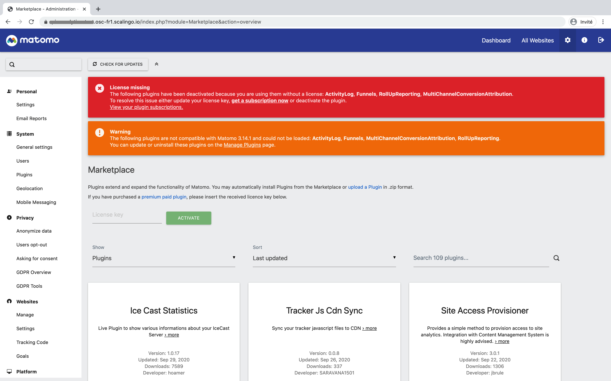

# Matomo-scalingo-deploy

[Matomo](https://matomo.org) is a free and open source web analytics application, designed to be an open and compliant with GDPR alternative to Google Analytics.

[Scalingo](https://scalingo.com) is a high-availability Platform as a Service (PaaS), like Heroku or Dokku.

This project is based on and uses the PaaS buildpack [matomo-buildpack](https://github.com/1024pix/matomo-buildpack).

## Usage

### Installation

**Pre-requesites:**
- you must be connected to your GitHub account
- you must be connected to a validated (with payment mode) Scalingo account

**Steps:**
1. Fork this repository
2. From the GitHub interface of your fork, edit the `README.md` file and change the "Deploy to Scalingo" href link to your repository's one
3. Save, commit and push your change
4. Click on the "one-click deployment" button below ; you will be redirected to the Scalingo new application interface
5. Fill-up the form about the Matomo application environment variables and follow the instructions

[](https://my.scalingo.com/deploy?source=https://github.com/1024pix/matomo-scalingo-deploy)


### Configuration

#### Override Matomo config

The Matomo buildpack [adds some plugins](https://github.com/1024pix/matomo-buildpack/tree/master/plugins) to the official distribution and especially a copy of the Matomo plugin [EnvironmentVariables](https://plugins.matomo.org/EnvironmentVariables).

This extension allows you to specify Matomo config in environment variables instead of the config file.

For example to overwrite the database username and password which is usually defined in the `config/config.ini.php` like this:
```
[database]
username = "root"
password = "secure"
```
using environment variables like this:
```
export MATOMO_DATABASE_USERNAME=root
export MATOMO_DATABASE_PASSWORD=secure
```

#### Manage Purchased plugins

If not yet done, set the environment variable `MATOMO_LICENSE_KEY` with your own [Matomo license key](https://fr.matomo.org/faq/how-to/how-do-i-get-a-license-key-for-the-maxmind-geolocation-database/) in your Scalingo app.

Then, declare your purchased plugins by setting the `MATOMO_PURCHASED_PLUGINS` environment variable as below:

```shell script
MATOMO_PURCHASED_PLUGINS=Funnels:3.1.22,ActivityLog:3.4.0,RollUpReporting:3.2.7
```

> Unfortunately, the Matomo plugins API does not provide a way to fetch the latest version of a given plugin for a given version à of Matomo (3.X or 4.X). It is why we must precise the version of each plugin.

If not yet done, configure your Matomo license key in the market place (entry "Platform" > "Market place" in the left nav bar).   



The first time, you may need to manually activate the plugins in the interface. Or you can simply restart the container and let the `bin/start-matomo.sh` script do it for you.

### Upgrade

> ⚠️ We strongly advise you to **not use the auto-update feature in the Matomo administration** interface at the risk of lose all your changes and having critical problems the next time your app will restart! 

There is two ways to upgrade your Matomo instance:
- a) wait for the [original repository](https://my.scalingo.com/deploy?source=https://github.com/1024pix/matomo-scalingo-deploy) to upgrade the current version and rebase your fork on it
- b) wait for matomo-buildpack to release a new version and change yourself the buidpack in `./buildpacks` file
